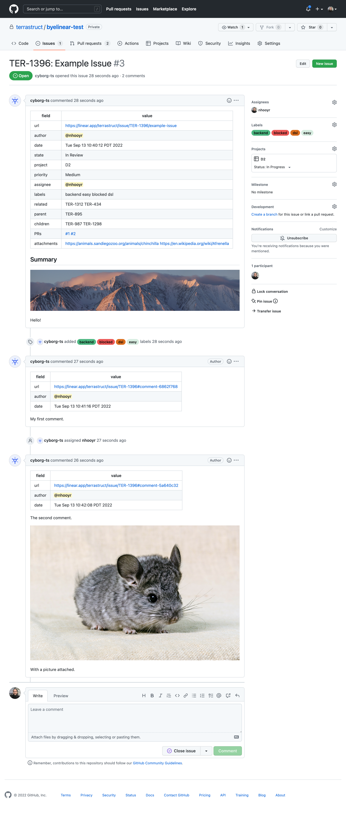

# Introduction
Linear에 존재하는 issue를 Github issue로 migration하기 위해 같은 용도인 [byelinear](https://github.com/terrastruct/byelinear)를 fork하여 custom하게 수정한 repository입니다.

## 변경점
- [06c4404](https://github.com/portone-io/byelinear/commit/06c4404dc8152097cc433508958b4c71dcc19bb5): Linear API Key를 Bearer prefix 없이 Authorization header에 설정하도록 변경
- [e295061](https://github.com/portone-io/byelinear/commit/e2950616f21adad7c36ba164192db28071371a3c): 현재는 지원하지 않는 Linear GraphQL object를 쿼리하지 않도록 수정
- [1aa8638](https://github.com/portone-io/byelinear/commit/1aa8638980e8468065cea830bc585662df4b3e3e): assignee 및 author 설정을 위해 Linear email -> Github username map 등록
- [b8eabaa](https://github.com/portone-io/byelinear/commit/b8eabaa9368fe52319b935b8ebbe9b8216a23e61): 특정 team의 issue만 가져올 수 있도록 argument로 team name 추가 및 query 필터 수정
- [2e2d0b6](https://github.com/portone-io/byelinear/commit/2e2d0b655606646731d9a63f38e7619bcfe61928): Linear의 label 정보는 가져오지 않도록 관련 코드 삭제
- [24c164a](https://github.com/portone-io/byelinear/commit/24c164a89f343300e00cee93fdab79ebf9b376d2): Github issue 제목에서 Linear identifier(ex. SRE-17)는 제외하도록 수정
- [4e7ef07](https://github.com/portone-io/byelinear/commit/4e7ef07e46eba76abf8b79c45d18461ca66c6d33): Slack 등 integration에 의해 생성된 comment에 User 정보가 없어 생기는 버그 수정
- [8346cab](https://github.com/portone-io/byelinear/commit/8346cabc8c206ffc112049ee761c37da5334728d): Linear의 project 이름에 해당하는 Github project를 찾고 없으면 생성하는 것이 아닌 추가할 issue를 추가할 Github project 명을 직접 입력하도록 argument 추가
- [37b4e94](https://github.com/portone-io/byelinear/commit/37b4e94e2f2c070c3e6392b9e5823422c6779794): Github API가 rate limit을 초과하였을 때 header에 있는 다음 호출 가능 시간을 print하도록 수정
- [41e8329](https://github.com/portone-io/byelinear/commit/41e8329544ab680065fc030275c1701dc9526fa9): Linear issue를 업로드하기 전 issue number의 오름차순으로 리스트를 sorting하도록 수정
- [278ce0e](https://github.com/portone-io/byelinear/commit/278ce0e61b2d1a5466095447c7b49c7d8eb07b5f): Linear identifier number와 github issue number를 맞추기 위해 삭제된 issue가 있는 경우 빈 issue를 생성 및 즉시 삭제하도록 수정

## 사용법
assignee 및 issue, comment 작성자가 github의 username으로 대체되길 원할 경우, [1aa8638](https://github.com/portone-io/byelinear/commit/1aa8638980e8468065cea830bc585662df4b3e3e)룰 참고하여 map을 수정합니다.
```shell
# Linear에 있는 issue들을 Local로 export하기
$ BYELINEAR_TEAM_NAME={Linear Team Name} LINEAR_API_KEY={Linear API Key} go run . from-linear
# Test용도로 특정 number의 issue만 export하기
$ BYELINEAR_ISSUE_NUMBER={Linear Issue number} BYELINEAR_TEAM_NAME={Linear Team Name} LINEAR_API_KEY={Linear API Key} go run . from-linear

# Local에 export된 Linear issue를 Github에 import하기
# Github PAT needs to be granted (repo, read:org, read:project) scopes
$ BYELINEAR_ORG={Github Organization Name} BYELINEAR_REPO={Github Repository Name} BYELINEAR_PROJECT_NAME={Github Project Name} GITHUB_TOKEN={Github Personal Access Token} go run . to-github
```

------

# byelinear

[](https://github.com/terrastruct/byelinear/actions/workflows/ci.yml)
[](https://github.com/terrastruct/byelinear/actions/workflows/daily.yml)
[](./LICENSE)

`byelinear` exports Linear issues including assignees, comments, labels, linked issues/PRs and projects to GitHub issues.

While we enjoyed Linear's slick UI and superior featureset, we ultimately decided that we
wanted our issues on the same platform with the rest of our development. GitHub issues
aren't perfect but they work well enough for us and are more tightly integrated with
GitHub. So we wrote this for our internal migration from Linear issues to GitHub issues.

byelinear uses the Linear GraphQL API and the GitHub V3 and V4 APIs.

<!-- toc -->
- <a href="#install" id="toc-install">Install</a>
- <a href="#configuration" id="toc-configuration">Configuration</a>
- <a href="#caveats" id="toc-caveats">Caveats</a>
  - <a href="#issues-order" id="toc-issues-order">Issues order</a>
  - <a href="#resumption" id="toc-resumption">Resumption</a>
  - <a href="#projects" id="toc-projects">Projects</a>
- <a href="#example" id="toc-example">Example</a>
  - <a href="#before" id="toc-before">Before</a>
  - <a href="#after" id="toc-after">After</a>
- <a href="#related" id="toc-related">Related</a>

## Install

```sh
$ go install oss.terrastruct.com/byelinear@latest
$ byelinear --help
usage:
        byelinear [ from-linear | to-github ]

Use from-linear to export issues from linear and to-github to export issues to github.
See docs and environment variable configuration at https://oss.terrastruct.com/byelinear
```

See configuration to setup the required environment variables. Then see the example below
for how to run and what the logs look like.

## Configuration

```sh
# Location of corpus for issues fetched from Linear.
# Defaults to linear-corpus in the current directory.
export BYELINEAR_CORPUS=

# Use to fetch and export only a single issue by the linear issue number. Useful for testing.
export BYELINEAR_ISSUE_NUMBER=

# org/repo into which to import issues.
# Required when running to-github.
export BYELINEAR_ORG=terrastruct
export BYELINEAR_REPO=byelinear

# Secrets required when importing/exporting with private repos/issues.
export GITHUB_TOKEN=
export LINEAR_API_KEY=
```

## Caveats

### Issues order

byelinear fetches Linear issues in reverse so that the most recent issue is created last
and thus shows up first in GitHub issues.

### Resumption

#### from-linear

If you have thousands of issues and hit a rate limit or something goes wrong, know that
`byelinear from-linear` stores all fetched issues on the disk in
`./linear-corpus/<issue-identifier>.json`. You can ctrl+c and resume later and `byelinear
from-linear` will know to start from the last fetched issue based on
`./linear-corpus/state.json`.

You can change the corpus directory with `$BYELINEAR_CORPUS`.

#### to-github

If something goes wrong when exporting to github and you ctrl+c, you can resume but you
might end up with an incomplete but also duplicate issue. To avoid this, first check your
repo to see the last created issue and ensure the state in the comment/linear matches the
github state. Mainly labels, projects and comments. Make any changes you need to to make
it match. Then go into `./linear-corpus/state.json` and ensure `"exported_to_json":true`.

Now you can restart.

In fact I now realize you might also end up with duplicate issues if say the request to
add your issue to a project fails. Or to create a comment. to-github's retry loop is
around recreating the issue again and redoing everything instead of around every
individual API request.

In the future to-github should be improved to allow seamless resumption by storing state
about each successfully completed operation in the state.json instead of just the issue
as a whole.

For now, it's best that once you start, you let it export every issue to GitHub.

### Projects

byelinear gets everything right except for projects and state as there are limitations in
GitHub's project API. There is no way to add a new project state/column programatically so
it tries to map incoming states to GitHub default states as best as possible.

e.g. In Review from Linear becomes In Progress on GitHub. Cancelled becomes Done.

As well, GitHub's projects API does not allow for control over workflow automations like
automatically setting an issue to In Progress when a PR is opened for it. You'll have to
manually go into the projects settings and enable the workflows there.

## Example

The following example fetches issue TER-1396 from linear and then exports it to GitHub.
Empty `$BYELINEAR_ISSUE_NUMBER` to fetch all issues.

```
$ BYELINEAR_ISSUE_NUMBER=1396 LINEAR_API_KEY=lin_api_... go run . from-linear
2022/09/15 12:44:09 fetching 1396
2022/09/15 12:44:10 fetched 1396
```

```
$ BYELINEAR_ISSUE_NUMBER=1396 GITHUB_TOKEN=ghp_... BYELINEAR_ORG=terrastruct BYELINEAR_REPO=byelinear-test go run . to-github
2022/09/15 12:44:49 TER-1396: exporting
2022/09/15 12:44:49 TER-1396: ensuring label: backend
2022/09/15 12:44:49 TER-1396: ensuring label: easy
2022/09/15 12:44:49 TER-1396: ensuring label: blocked
2022/09/15 12:44:50 TER-1396: ensuring label: dsl
2022/09/15 12:44:50 TER-1396: creating
2022/09/15 12:44:51 TER-1396: creating comment 0
2022/09/15 12:44:52 TER-1396: creating comment 1
2022/09/15 12:44:52 TER-1396: ensuring project: D2
2022/09/15 12:44:54 TER-1396: exported: https://github.com/terrastruct/byelinear-test/issues/3
```

### Before


### After



## Related

- [https://github.com/jccr/linear-to-gitlab](https://github.com/jccr/linear-to-gitlab)
